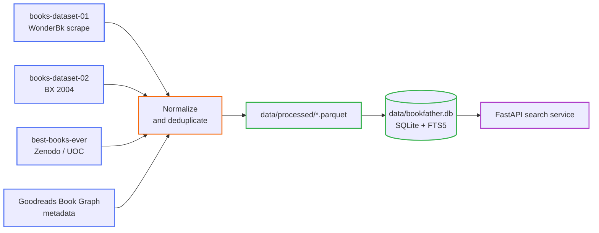
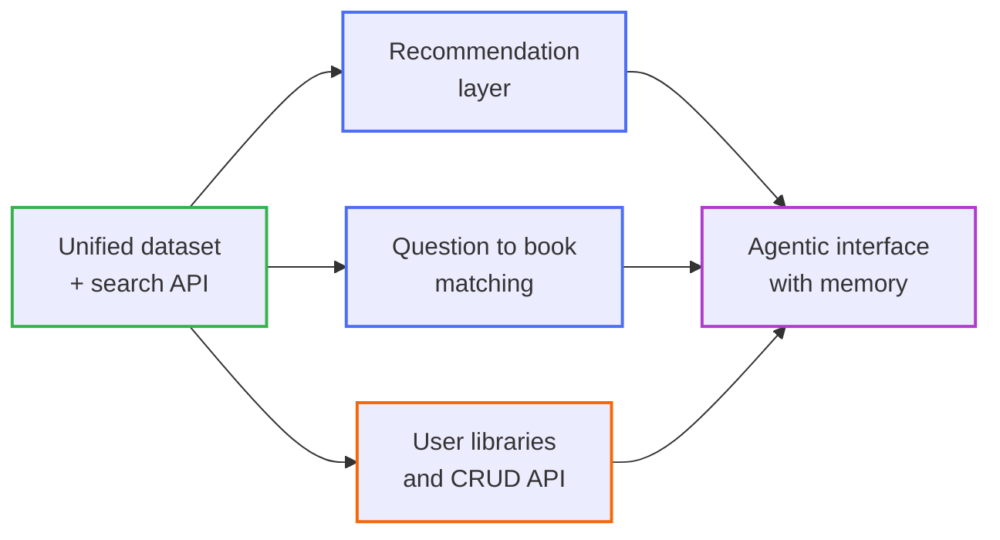

# The Bookfather

A book discovery engine built on top of four large, independently-collected book datasets
merged into one clean, queryable source of truth — with a read-only search API today and an
agentic recommendation layer as the destination.

> Full documentation (setup, EDA, data pipeline, database schema, API, deployment):
> **[docs/index.md](docs/index.md)**

---

## Current state

<details open>
<summary><strong>What works today</strong></summary>

| Capability | Status | Where |
|---|---|---|
| Ingest 4 raw book sources (~2.5M records) | ✅ Done | [`src/cleaning/readers.py`](src/cleaning/readers.py) |
| Normalize + cross-source deduplicate into one canonical `books` table | ✅ Done | [`src/cleaning/normalize.py`](src/cleaning/normalize.py), [`src/cleaning/merge.py`](src/cleaning/merge.py) |
| Unified SQLite database with normalized authors/genres, provenance, FTS5 index | ✅ Done | [`src/db/build_db.py`](src/db/build_db.py), [`src/db/schema.sql`](src/db/schema.sql) |
| Goodreads Book Graph downloader (idempotent, tiered) | ✅ Done | [`src/datasets/goodreads_downloader.py`](src/datasets/goodreads_downloader.py) |
| Read-only search API (FTS5 string match, book detail, similar-books, genre browse) | ✅ Done | [`src/api/main.py`](src/api/main.py) |
| Query→book recommendation service — 6 methods, efficient→intelligent | ✅ Done | [`src/recommend/`](src/recommend/), [docs/recommendation/index.md](docs/recommendation/index.md) |
| Personalised (user→book) recommendation — collaborative / neural | 🔭 Vision | needs Goodreads interactions tier |
| Dockerized service (small image, data bind-mounted read-only) | ✅ Done | [`docker/`](docker/), [docs/deployment.md](docs/deployment.md) |
| Hierarchical project documentation | ✅ Done | [`docs/`](docs/) |

</details>

<details>
<summary><strong>Data pipeline at a glance</strong></summary>



</details>

<details>
<summary><strong>API surface (read-only, this phase)</strong></summary>

| Endpoint | Purpose |
|---|---|
| `GET /health` | Service status + current book count |
| `GET /books/search?q=&limit=&offset=` | Free-text search over title / authors / description (SQLite FTS5, bm25-ranked) |
| `GET /books/{book_id}` | Full canonical book detail with resolved authors and genres |
| `GET /books/{book_id}/similar?limit=` | Fallback recommendation — heuristic on shared authors (3×) + shared genres |
| `GET /genres?limit=` | Genre names with book counts, for "browse by genre" |
| `GET /recommend?q=&method=&limit=` | Recommend books from a free-text query; `method` ∈ `popularity·lexical·tfidf·lsa·semantic·hybrid` |
| `GET /recommend/methods` | The methods, their tier, and whether each is available right now |

Interactive docs at `http://127.0.0.1:8000/docs`. Details: [docs/api/endpoints.md](docs/api/endpoints.md).

</details>

<details>
<summary><strong>Recommendation methods (efficient → intelligent)</strong></summary>

| Method | Tier | Idea |
|---|---|---|
| `popularity` | baseline | infer genre from the query → rank by Bayesian weighted rating |
| `lexical` | traditional IR | FTS5 BM25 keyword match + popularity prior |
| `tfidf` | classic ML | TF-IDF bag-of-words vector space, cosine similarity |
| `lsa` | latent factors | Truncated SVD topic vectors over TF-IDF, cosine |
| `semantic` | deep learning | `all-MiniLM-L6-v2` sentence embeddings, cosine (optional DL stack) |
| `hybrid` | ensemble (default) | Reciprocal Rank Fusion of the above |

`tfidf`/`lsa` need artifacts from `python -m src.recommend.build_artifacts`; `semantic` also
needs `requirements-dl.txt`. `hybrid` fuses whatever is available. Full concept / advantages /
limitations / improvement notes per method: **[docs/recommendation/index.md](docs/recommendation/index.md)**.

</details>

---

## Quick start

```bash
# 1. Install dependencies
pip install -r requirements.txt

# 2. Build the dataset + recommendation artifacts end to end
#    (download → clean/merge → build SQLite DB → build tfidf/lsa artifacts)
./scripts/run_pipeline.sh

# 3. Run the API
python -m uvicorn src.api.main:app --reload
curl "http://127.0.0.1:8000/books/search?q=hunger+games"
curl "http://127.0.0.1:8000/recommend?q=a+hopeful+space+opera+about+first+contact&method=hybrid"
```

Or run the service in Docker:

```bash
cp docker/env/.env.example docker/env/.env
docker compose --env-file docker/env/.env -f docker/compose/docker-compose-sys-01.yaml up -d --build
curl http://localhost:8000/health
```

See [docs/scripts/index.md](docs/scripts/index.md) for per-step usage and
[docs/deployment.md](docs/deployment.md) for the Docker setup.

---

## Future vision

The unified dataset is the foundation. The roadmap moves from *lookup* to *understanding*: from
"find me this book" to "understand what I'm looking for and recommend the right book."

<details open>
<summary><strong>1. Recommendation layer</strong></summary>

- **Query→book — built.** `GET /recommend` with 6 methods from a popularity baseline to
  transformer embeddings, fused by `hybrid`. See
  [docs/recommendation/index.md](docs/recommendation/index.md).
- **Personalised (user→book) — next.** Ingest the **Goodreads interactions tier** (112M reads,
  104M ratings) to add collaborative filtering, matrix factorisation, and neural/sequential
  recommenders, and to give the `similar` endpoint a real model.
- **Warm start** — "tell us a few books you loved" and get personalized recommendations.
- **Cross-encoder / LLM re-rank** on top of the query→book shortlist for sharper intent
  matching and natural-language rationales.

</details>

<details>
<summary><strong>2. Agentic AI interface</strong></summary>

- Natural-language, contextual book search ("a hopeful sci-fi novel about first contact, not too long").
- **Agentic memory** — build a model of the reader's taste and intent over time, across sessions,
  from the books they browse, save, and rate.

</details>

<details>
<summary><strong>3. Learning from experience</strong></summary>

- Ask a *question* ("how do I get better at negotiating?") and get a book that answers it —
  matching problems to books, not just keywords to titles.

</details>

<details>
<summary><strong>4. Full CRUD API</strong></summary>

- Write endpoints for user libraries, shelves, ratings, and reviews on top of the read-only core.

</details>



---

## Dataset resources

<details>
<summary><strong>Books Dataset 01 — WonderBk scrape</strong></summary>

Information scraped from wonderbk.com, a popular online bookstore: ~103,063 books with title,
authors, description, category, publisher, starting price, and publish date.

<https://www.kaggle.com/datasets/elvinrustam/books-dataset>

</details>

<details>
<summary><strong>Books Dataset 02 — Book-Crossing (BX), 2004</strong></summary>

Compiled by Cai-Nicolas Ziegler in 2004. Three tables — users, books, ratings. Explicit ratings
on a 1–10 scale; implicit ratings expressed as 0.

<https://www.kaggle.com/datasets/saurabhbagchi/books-dataset> ·
<http://www2.informatik.uni-freiburg.de/~cziegler/BX/>

</details>

<details>
<summary><strong>Best Books Ever Dataset</strong></summary>

Collected for the Prac1 of *Typology and Data Life Cycle*, Master's Degree in Data Science,
Universitat Oberta de Catalunya (UOC).

<https://zenodo.org/records/4265096>

</details>

<details>
<summary><strong>Goodreads Book Graph Datasets</strong></summary>

Collected in late 2017 from goodreads.com public shelves (anonymized, academic/non-commercial
use). Three groups: (1) book metadata, (2) user–book interactions, (3) detailed reviews —
joinable on book / user / review ids.

Complete Book Graph: 2,360,655 books (1,521,962 works, 400,390 series, 829,529 authors);
876,145 users; 228,648,342 user–book interactions (112,131,203 reads, 104,551,549 ratings).

<https://cseweb.ucsd.edu/~jmcauley/datasets/goodreads.html>

</details>

<details>
<summary><strong>Other sources</strong></summary>

1. <https://github.com/scostap/goodreads_bbe_dataset>
2. <https://zenodo.org/records/4265096>
3. <https://news.ycombinator.com/item?id=44252070>

</details>
