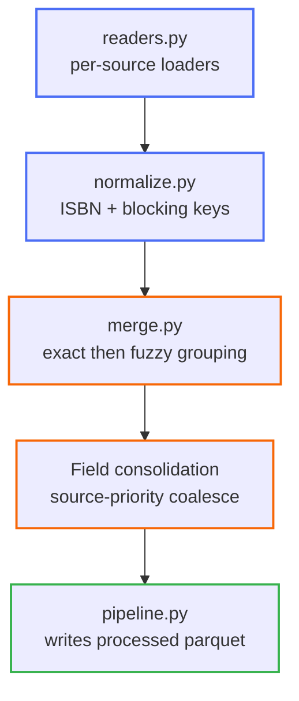

# Data Cleaning

<strong>Pipeline stages</strong>

- [Normalization](normalization.md) — ISBN validation/derivation, title/author blocking keys
- [Deduplication](deduplication.md) — the 3-stage cross-source matching strategy and its cost bounds

Code: [`src/cleaning/`](../../src/cleaning/) (`readers.py`, `normalize.py`, `merge.py`, `pipeline.py`)
