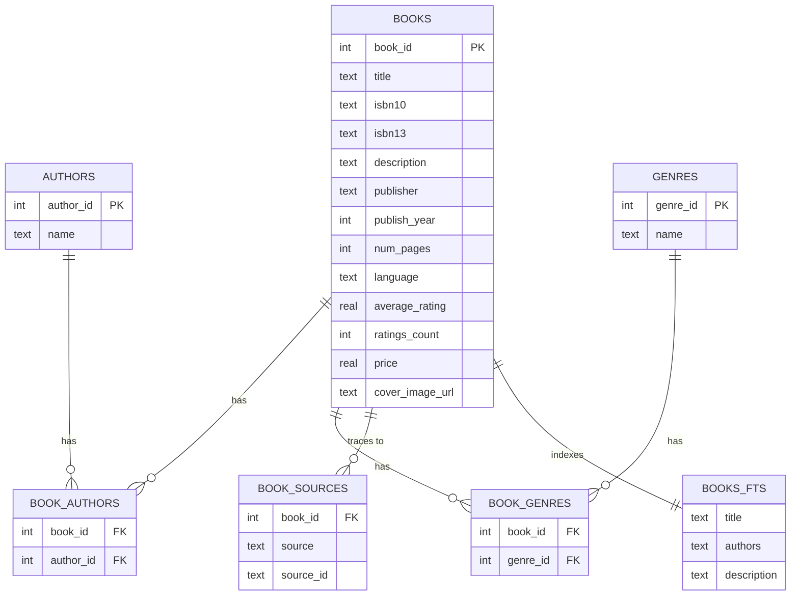

# Database Schema

DDL: [`src/db/schema.sql`](../../src/db/schema.sql) · Loader: [`src/db/build_db.py`](../../src/db/build_db.py)
Output: `data/bookfather.db` (SQLite)

<strong>ER diagram</strong>

<strong>Design notes</strong>

- **`book_sources` is the provenance table** — every raw row that contributed to a canonical
  `books` row is traceable back to its source dataset and original id. This makes the merge
  auditable/reversible without re-running the whole pipeline.
- **`authors` and `genres` are normalized, not denormalized into `books`** — a book can have
  multiple authors/genres, and this also lets `/genres` and similar-books scoring query them
  directly without scanning free-text columns.
- **`books_fts` is a contentless FTS5 virtual table** (`content=''`) — it stores only the search
  index, not a duplicate copy of the text; `rowid` is set equal to `book_id` at insert time so a
  match can be joined straight back to `books`. Tokenizer is `porter unicode61` for basic
  stemming (`"running"` matches `"run*"`-style queries reasonably).
- Indexes exist on `isbn10`, `isbn13`, and `title` on `books`, and on the FK columns of the join
  tables, to keep lookups and the similar-books genre/author overlap query fast.

<strong>Rebuilding the database</strong>

`build_db.py` **drops and recreates** `data/bookfather.db` from `data/processed/*.parquet` every
run — it's not incremental. Re-run `python -m src.cleaning.pipeline` first if the processed
parquet is stale, then `python -m src.db.build_db`. See [Scripts](../scripts/index.md).

