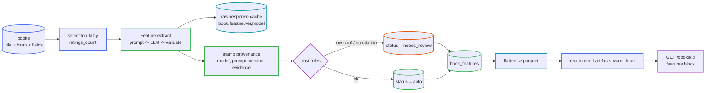

# LLM Feature Enrichment

The build side of the plan in
[LLM-Derived Book Features](../recommendation/llm-derived-features.md): a provider-agnostic
framework that turns each book's text into a **structured, provenanced feature record**, and
flattens it into a parquet artifact the recommender loads next to `tfidf` / `lsa` / `semantic`.

Package: [`src/enrich/`](../../src/enrich/) ·
Schema: [`src/db/schema_features.sql`](../../src/db/schema_features.sql) ·
Offline CLI: [`src/enrich/build_features.py`](../../src/enrich/build_features.py) ·
Flattener: [`src/enrich/flatten.py`](../../src/enrich/flatten.py)

> **Status:** Stage 1 (framework + schema + flattener) and Stage 2 (first six features, LLM
> prior only) are **built**. Stages 3–6 (RAG endorsement features, the self-correcting
> emotion updater, graph features, scale-out) are still roadmap.

<details open>
<summary><strong>Pipeline at a glance</strong></summary>



</details>

---

## The tables

Added by [`schema_features.sql`](../../src/db/schema_features.sql); the base `books` row is
**never widened**. Applied to the live DB with `python -m src.db.build_db --features-only`
(idempotent — every statement is `IF NOT EXISTS`), and automatically as part of a full
`build_db` run.

<details open>
<summary><strong><code>book_features</code></strong> — the generic key/value store</summary>

One row per `(book_id, feature, prompt_version)` — the primary key, which is what makes the
CLI re-runnable and idempotent.

| Column | Purpose |
|---|---|
| `value_json` | the feature payload (scalar / list / object) as JSON |
| `confidence` | 0–1 |
| `feature_type` | `extractive` \| `rag` \| `judgment` \| `derived` |
| `source` | `blurb` \| `rubric:<name>@<ver>` \| `web:<url>` \| `derived:<formula>` |
| `evidence` | span text (extractive/judgment), URL+snippet (rag), or formula (derived) |
| `model`, `prompt_version`, `extracted_at` | provenance — **mandatory on every row** |
| `status` | `auto` \| `needs_review` \| `verified` \| `rejected` |

Indexes: `idx_book_features_feature`, `idx_book_features_status`.

</details>

<details>
<summary><strong><code>people</code> / <code>book_people</code></strong> — normalised endorsers (Stage 3)</summary>

`people(name, domain, fame_tier)` + `book_people(book_id, person_id, relationship, quote,
strength)` so "foreword by a founder/CEO" becomes a join. Created now; populated in Stage 3.

</details>

<details>
<summary><strong><code>book_accolades</code></strong> — facts with their own shape (Stage 3)</summary>

`(book_id, kind, detail_json)` for bestseller runs, awards, sales, printings, translations,
adaptations. `kind`-indexed. RAG-only when populated — a citation or it stays low-confidence.

</details>

<details>
<summary><strong><code>book_relations</code></strong> — book-to-book edges (Stage 5)</summary>

`(src_book_id, relation, dst_book_id|dst_hint, axis, why, weight)`. Uniqueness is a
`UNIQUE INDEX` over the COALESCEd target (SQLite forbids expressions in a `PRIMARY KEY`).
Seeds item–item CF and synthetic reading sequences later.

</details>

---

## The CLI

```bash
# 1. one-time: add the tables to the existing database
python -m src.db.build_db --features-only

# 2. estimate first — renders every prompt, prints a token/cost estimate, writes nothing
python -m src.enrich.build_features --features all --max-books 50 --dry-run

# 3. enrich a cheap first slice (default 5000 books, NVIDIA free tier)
export NVIDIA_API_KEY=...        # read from the env only; never stored in the repo
python -m src.enrich.build_features --features five_sentence_summary,emotion_profile --max-books 5000

# 4. flatten to the artifact the API/recommender load
python -m src.enrich.flatten
```

<details>
<summary><strong>Flags</strong> — <a href="../../src/enrich/build_features.py">build_features.py</a></summary>

| Flag | Default | Notes |
|---|---|---|
| `--features` | `all` | `all` or a comma-separated subset of the registry |
| `--max-books` | `5000` | top-N by `COALESCE(ratings_count,0) DESC` with a description ≥ 50 chars |
| `--provider` | `nvidia` | `nvidia` (NVIDIA NIM, OpenAI-compatible, free models) · `anthropic` (optional SDK) · `stub` (offline, deterministic) |
| `--model` | provider default | nvidia ⇒ `openai/gpt-oss-120b`, anthropic ⇒ `claude-sonnet-5` |
| `--dry-run` | off | render prompts + estimate, write nothing |
| `--refresh` | off | re-extract books that already have a current-version row |
| `--db` | `data/bookfather.db` | |

- Same "most worth enriching first" selection as
  [`build_artifacts.py`](../../src/recommend/build_artifacts.py).
- Re-runnable: books with a non-rejected row for the current `prompt_version` are skipped
  unless `--refresh`.
- Raw responses are cached under `data/llm_cache/` keyed by
  `(book_id, family, feature, prompt_version, provider, model)`, so a re-run costs nothing.
- Logs INFO per stage + a cost/count summary to stdout, DEBUG per book to
  `logs/enrich.log`.

</details>

<details>
<summary><strong>Providers</strong></summary>

The client ([`src/enrich/client.py`](../../src/enrich/client.py)) is genuinely
provider-agnostic — cross-cutting behaviour (cache, dry-run, retry-once-then-review) lives in
the client, backends only do one HTTP/SDK call.

- **`nvidia`** (default) — NVIDIA NIM's OpenAI-compatible `/chat/completions` over the
  existing `requests` dependency. Free hosted models; per the project decision to use NVIDIA
  free keys first. `NVIDIA_API_KEY` from the environment.
- **`anthropic`** — the `anthropic` SDK, imported lazily; install it to use
  `--provider anthropic --model claude-opus-5` for a higher-quality pass on the top slice
  (the plan's "cheap for extraction, expensive for judgment on the top slice").
- **`stub`** — no network; the feature supplies a canned payload. Rows are forced
  `needs_review` (`model = stub`). Used by tests and to smoke-test the full pipeline.

The API key is only ever read from the environment — never logged, cached, or written to
disk.

</details>

---

## Prompt-version policy

`prompt_version` (e.g. `v1`) is part of the primary key. To improve a feature's prompt:
bump its `prompt_version` in the feature module, then run `build_features` for that feature —
it re-extracts every book at the new version (old rows stay, so a comparison is possible).
`flatten` keeps only the **highest** `prompt_version` per `(book_id, feature)` whose status
is not `rejected`, so the artifact automatically follows the newest prompt. No full rebuild.

---

## Review queue & trust rules

Enforced in [`persist.py`](../../src/enrich/persist.py) — a row is stored with
`status = needs_review` (never silently trusted) when **any** of:

- the LLM response was unparseable after one retry, or failed schema validation;
- `confidence < 0.55`;
- `feature_type = rag` and there is **no citation** ("no feature is trusted as fact without
  a citation");
- an `extractive` / `judgment` row has no evidence span; a `derived` row has no formula;
- `model = stub`.

A row missing `model` / `prompt_version` / `extracted_at` is a programming error and raises.
`needs_review` rows are still written (so the work isn't lost and a human can promote them to
`verified`); they are still exported by `flatten` and shown in the API with their status.

---

## Cost controls

- Enrich in **`ratings_count` order**, only `--max-books` at a time (default 5000).
- **Free NVIDIA models by default**; Anthropic is opt-in per run.
- Every raw response is **cached**; re-runs and prompt-version comparisons are free.
- **`--dry-run`** prints an aggregate token/cost estimate before you spend anything.
- Idempotent skip-existing means an interrupted run resumes cheaply.

---

## Feature status

| Feature | Family | Type | Prompt | Live | Notes |
|---|---|---|---|---|---|
| `five_sentence_summary` | content distillation | extractive | v1 | ✅ | spoiler-free constraint + spoiler flag |
| `one_line` | content distillation | judgment | v1 | ✅ | ≤ 20-word logline, rubric embedded |
| `storytelling_type` | narrative craft | judgment | v1 | ✅ | multi-label, closed set, rubric embedded |
| `lessons` | content distillation | extractive | v1 | ✅ | `count` = `len(lessons)` |
| `test_of_time` | temporal judgment | judgment | v1 | ✅ | label + `datedness`; blurb-only prior |
| `emotion_profile` | emotional profile | judgment | v1 | ✅ | **LLM prior only** — per-emotion `{intensity, confidence}` over the §4.1 ontology; lexical scorer + Beta online updater are Stage 4 |

Registered in [`src/enrich/registry.py`](../../src/enrich/registry.py).

---

## Downstream wiring (thin, non-breaking)

- [`src/recommend/artifacts.py`](../../src/recommend/artifacts.py): `get_features()` +
  `warm_load` of `data/artifacts/features/` — loaded exactly like the vector artifacts,
  best-effort (a missing artifact just omits the block).
- [`src/api/main.py`](../../src/api/main.py): `GET /books/{book_id}` gains an optional
  `features` block `{feature: {value, confidence, status}}` when the book is enriched.
  `GET /books/search` and `GET /recommend` responses are **unchanged**.

## Tests

`pytest -q` — no network, the LLM client is mocked/stubbed. Covers: schema creation +
migration idempotency + PK upsert; every feature module (canned context + stubbed JSON →
provenanced `FeatureRow`; malformed JSON → review path); persistence trust rules; `flatten`
row count == distinct enriched books; `--dry-run` writes nothing.
