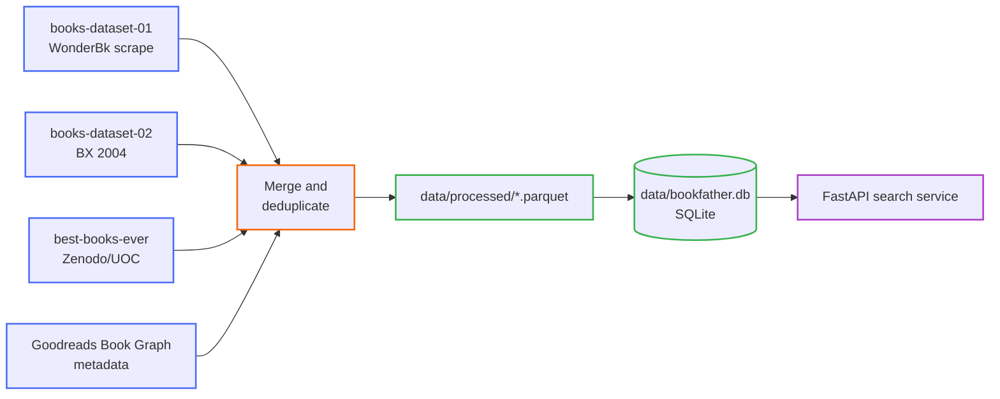

# The Bookfather — Documentation

Hub for everything about the data pipeline, database, and search API built in this phase of the project.
See the top-level [README.md](../README.md) for the full product feature list.

<strong>Where to start</strong>

- New to the project? Read [Assumptions](assumptions.md) first — it lists every non-obvious
  decision made while merging 4 messy, independently-collected datasets into one.
- Want to run something? Go straight to [Scripts](scripts/index.md).
- Want to query the data? See [Useful SQL Queries](sql/useful-queries.md).
- Building against the API? See [API Endpoints](api/endpoints.md).

## Contents

| Section | What's in it |
|---|---|
| [Assumptions](assumptions.md) | Every non-obvious call made during cleaning/merging, and why |
| [Exploratory Data Analysis](eda/index.md) | Per-source profiling: shape, nulls, key coverage |
| [Data Cleaning](data-cleaning/index.md) | Normalization rules and the cross-source dedup strategy |
| [Database](database/schema.md) | SQLite schema, ER diagram, design rationale |
| [Scripts](scripts/index.md) | How to run the downloader, cleaning pipeline, and DB build |
| [SQL Queries](sql/useful-queries.md) | Copy-pasteable queries for exploring `data/bookfather.db` |
| [API](api/endpoints.md) | Search API endpoints, request/response shapes |

## Pipeline at a glance

