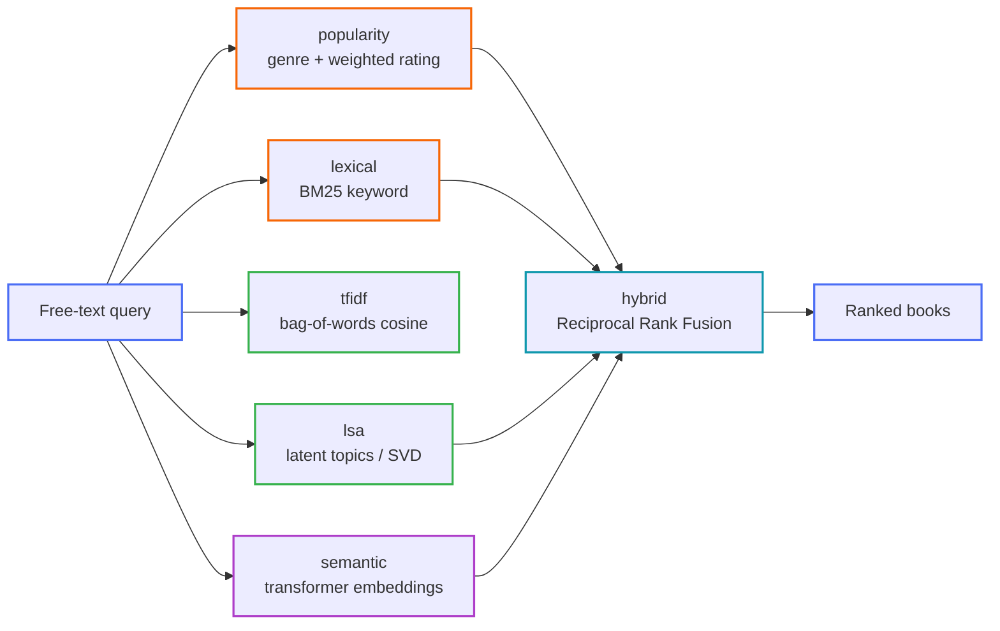

# Recommendation

How `GET /recommend?q=...&method=...` turns a free-text description of what a reader wants
("a hopeful space opera about first contact", "something to help me get over a break-up")
into a ranked list of books — and the trade-offs of each algorithm it can use.

App: [`src/api/main.py`](../../src/api/main.py) ·
Package: [`src/recommend/`](../../src/recommend/) ·
Offline builder: [`src/recommend/build_artifacts.py`](../../src/recommend/build_artifacts.py)

> Companion plan: **[LLM-Derived Book Features](llm-derived-features.md)** — the structured,
> provenanced per-book feature record (endorsements, narrative craft, emotional profile,
> test-of-time, comparables…) that the personalised methods below depend on, plus a
> self-correcting emotion engine and an implementation prompt.

<details open>
<summary><strong>Scope: this is query→item, not user→item</strong></summary>

Every method here ranks books against a **query string**. None of them personalise to a
*reader's history*, because the per-user interaction data (the Goodreads "interactions" tier —
112M reads, 104M ratings) is **not ingested yet**. Collaborative filtering and neural
sequence models are sketched in [Not yet built](#not-yet-built--collaborative--neural) and
land once that tier is loaded.

</details>

## The spectrum

Six methods, cheapest/most-transparent on the left, most semantic/most-expensive on the right.
`hybrid` is the default and fuses the others.



| Method | Tier | Latency | Extra memory | Needs artifact | Needs DL deps | Cold-start | Interpretable | Understands intent |
|---|---|---|---|---|---|---|---|---|
| `popularity` | baseline | ~1 ms | none | no | no | ✅ | ✅ high | ❌ genre only |
| `lexical` | traditional IR | ~2–5 ms | none | no | no | ✅ | ✅ high | ❌ keywords only |
| `tfidf` | classic ML | ~10–30 ms | ~0.3–1 GB matrix | yes | no | ✅ items | ✅ (shared terms) | ⚠️ weak |
| `lsa` | latent-factor ML | ~5–15 ms | ~n·k·4 bytes | yes | no | ✅ items | ⚠️ topics fuzzy | ⚠️ partial |
| `semantic` | deep learning | ~20–60 ms | model ~90 MB + n·384·4 B | yes | yes | ✅ items | ❌ opaque | ✅ strong |
| `hybrid` | ensemble | sum of parts | sum of parts | uses others' | no | ✅ | ⚠️ composite | ✅ (inherits) |

Scores are **method-specific** — compare them only *within* one response, never across methods.

---

## `popularity` — the trivial baseline

<details open>
<summary><strong>Concept</strong></summary>

Ignore the content of the query almost entirely. Read the **genre(s)** the reader seems to be
asking for out of their words, then return the best-loved books on those shelves. This is the
"what's good in this section" list every bookshop has by default.

</details>

<details>
<summary><strong>How it works here</strong> — <a href="../../src/recommend/popularity.py">popularity.py</a></summary>

1. Tokenise the query, drop stop-words ([`text.content_tokens`](../../src/recommend/text.py)).
2. `LIKE`-match those tokens against the ~2.8k rows in `genres` → a set of `genre_id`s
   ([`repository.genre_ids_for_tokens`](../../src/api/repository.py)).
3. Rank books in those genres by the **Bayesian weighted rating** (the "IMDb Top 250" formula):

   `WR = (v / (v + m)) · R  +  (m / (v + m)) · C`

   where `R` = the book's `average_rating`, `v` = its `ratings_count`, `C` = the global mean
   rating over well-rated books, `m` = a prior strength (50 ratings). A book with few ratings
   is pulled toward the global mean, so one 5-star rating can't beat a classic at 4.3 with 40k
   ratings.
4. No genre matched → fall back to the global weighted-rating leaderboard.

</details>

<details>
<summary><strong>Advantages</strong></summary>

- Zero artifacts, zero training, no dependencies.
- Sub-linear: served straight off the `idx_book_genres_genre` index.
- Immune to the **user cold-start** problem — needs nothing about the reader.
- A genuinely hard baseline to beat on "give me something good".

</details>

<details>
<summary><strong>Limitations</strong></summary>

- Not query-aware beyond genre — "funny sci-fi about a depressed robot" and "grimdark sci-fi
  war epic" get the *same* list.
- **Popularity bias / rich-get-richer**: already-famous books keep winning; the long tail is
  invisible.
- Genre vocabulary is coarse and messy (`"history, historical fiction, biography"` is a single
  genre string in the data), so token matching is blunt.
- Nothing for a novel-but-precise request that names no recognisable shelf.

</details>

<details>
<summary><strong>How to improve</strong></summary>

- Time-decay the rating so "currently loved" beats "loved in 2009".
- Personalise `C` per genre (a 4.0 sci-fi book is not a 4.0 poetry book).
- Diversify with **MMR** (maximal marginal relevance) so the list isn't five volumes of one
  series.
- Replace substring genre matching with a learned query→genre classifier.

</details>

---

## `lexical` — classical information retrieval

<details open>
<summary><strong>Concept</strong></summary>

Treat the query as a bag of keywords and score every book by **Okapi BM25** over its title,
author names and description — the workhorse ranking function behind Lucene/Elasticsearch.
BM25 rewards rare query terms, saturates on term-frequency (the 10th "dragon" adds little over
the 3rd) and normalises for document length.

</details>

<details>
<summary><strong>How it works here</strong> — <a href="../../src/recommend/lexical.py">lexical.py</a></summary>

1. Every alphanumeric token becomes a prefix term, ANDed:
   [`repository._build_fts_query`](../../src/api/repository.py).
2. SQLite **FTS5** returns the top matches ordered by its built-in `bm25()`
   ([`repository.fts_candidates`](../../src/api/repository.py)) — the `books_fts` index is
   built in [`src/db/build_db.py`](../../src/db/build_db.py).
3. Re-rank the candidate pool by blending the (normalised) BM25 score with a **log-damped
   popularity prior** so that, among equally good text matches, the better-loved book wins:
   `score = 0.85·bm25_norm + 0.15·rating_norm`.

</details>

<details>
<summary><strong>Advantages</strong></summary>

- No model, no artifacts; millisecond latency from the inverted index.
- Fully **interpretable** — the hit is "these words matched".
- Excellent when the reader types concrete strings: a title fragment, an author, a character
  or place name.
- Exact-match precision the vector methods can't guarantee.

</details>

<details>
<summary><strong>Limitations</strong></summary>

- **Vocabulary mismatch**: "space opera" misses a blurb that only says "interstellar empire".
- No notion of meaning, intent, or negation — "*not* a romance" still matches on "romance".
- Sensitive to spelling and morphology beyond the Porter stemmer already in the FTS config.
- Short/vague queries return noise.

</details>

<details>
<summary><strong>How to improve</strong></summary>

- **Query expansion**: add synonyms / related terms (a thesaurus, or pseudo-relevance
  feedback — take terms from the top-k first-pass results and re-query).
- Field boosting: weight a title hit above a description hit explicitly.
- Fuzzy/trigram matching for typos.
- **Learning-to-rank** (LambdaMART / XGBoost-rank) over features {BM25 per field, rating,
  recency, click-through} once interaction logs exist.

</details>

---

## `tfidf` — classic machine learning (content-based)

<details open>
<summary><strong>Concept</strong></summary>

Represent every book as a **TF-IDF vector**: one weight per vocabulary term, high when the
term is frequent in *this* book but rare across the *corpus* (inverse document frequency).
The query is projected into the same space and ranked by **cosine similarity**. This is the
canonical content-based recommender — no labels, no training signal, just linear algebra over
text statistics.

</details>

<details>
<summary><strong>How it works here</strong> — <a href="../../src/recommend/content.py">content.py</a>, <a href="../../src/recommend/build_artifacts.py">build_artifacts.py</a></summary>

- **Offline**: over the top-N books by ratings count with a usable description, fit a
  `TfidfVectorizer` (unigrams + bigrams, English stop-words, `min_df=3`, sublinear TF), L2-
  normalise the rows, and persist `{vectorizer.joblib, matrix.npz, book_ids.npy, meta.json}`
  to `data/artifacts/tfidf/`.
- **Online**: `warm_load` maps the sparse matrix into memory once at start-up. Per request:
  vectorise the query with the *same* fitted vectoriser, L2-normalise, one sparse
  matrix–vector product = all cosine scores, `argpartition` for top-k. The `reason` lists the
  query terms that actually overlapped that book.

</details>

<details>
<summary><strong>Advantages</strong></summary>

- Captures **term importance** — down-weights "the", "story"; up-weights "dystopian",
  "cetacean".
- No **item cold-start**: a brand-new book is recommendable the moment it has a blurb.
- Still interpretable: the overlapping terms are shown.
- Deterministic and cheap to rebuild.

</details>

<details>
<summary><strong>Limitations</strong></summary>

- Purely lexical — **no synonymy** ("WWII" vs "Second World War"), no word order
  ("dog bites man" = "man bites dog").
- The matrix is large: hundreds of MB to ~1 GB at 300k books × 150k terms, and it grows with
  the catalogue.
- Sensitive to description length and quality; sparse blurbs → sparse vectors → weak matches.
- Bigrams help a little with phrases but blow up the vocabulary.

</details>

<details>
<summary><strong>How to improve</strong></summary>

- **BM25-weighted** term vectors instead of raw TF-IDF (BM25 is a better similarity in
  practice).
- Character n-grams for robustness to spelling/morphology and multilingual blurbs.
- Explicit **field weighting**: separate title / description / genre sub-vectors, learn the
  blend.
- Feed the vector into the next tier (that's exactly what `lsa` does).

</details>

---

## `lsa` — latent-factor machine learning

<details open>
<summary><strong>Concept</strong></summary>

**Latent Semantic Analysis**: run **Truncated SVD** on the TF-IDF matrix to compress ~150k
sparse term dimensions down to a few hundred dense **latent "topic"** dimensions. Books that
discuss the same thing in different words end up near each other even with zero shared terms,
because those words co-occur across the corpus. Scoring becomes a small dense dot product.

</details>

<details>
<summary><strong>How it works here</strong> — <a href="../../src/recommend/content.py">content.py</a></summary>

- **Offline**: `TruncatedSVD(n_components≈256)` on the same TF-IDF matrix; L2-normalise the
  resulting dense rows; persist `{vectorizer.joblib, svd.joblib, embeddings.npy,
  book_ids.npy, meta.json}` (with the explained-variance ratio) to `data/artifacts/lsa/`.
- **Online**: query → TF-IDF → `svd.transform` → L2-normalise → one dense
  `embeddings @ q` = all cosines → top-k.

</details>

<details>
<summary><strong>Advantages</strong></summary>

- Bridges some **vocabulary gap** — the classic LSA win over raw TF-IDF.
- Compact and fast: `n × 256` float32 is far smaller than the sparse term matrix, and the dot
  product is a single BLAS call.
- Denoises: rare idiosyncratic terms get folded into broader factors.

</details>

<details>
<summary><strong>Limitations</strong></summary>

- **Linear** — it captures co-occurrence, not genuine contextual meaning; negation and
  compositional phrases still defeat it.
- Latent dimensions are **not human-readable** ("topic 47" has no name).
- Truncation loses signal; too few components → everything looks similar, too many → you're
  back to TF-IDF's noise. On this corpus 256 components explain only a modest fraction of
  variance (TF-IDF matrices are very high-rank).
- Must be **refit** when the corpus shifts.

</details>

<details>
<summary><strong>How to improve</strong></summary>

- **NMF** or **LDA** instead of SVD for non-negative, more interpretable topics.
- Tune `n_components` against a held-out relevance set rather than guessing.
- Randomised SVD with more power iterations for a cleaner low-rank fit.
- Ultimately: replace the linear factorisation with the non-linear encoder in `semantic`.

</details>

---

## `semantic` — deep learning

<details open>
<summary><strong>Concept</strong></summary>

Encode the query and every book blurb with a pretrained **Transformer sentence encoder**
(`all-MiniLM-L6-v2` — a 6-layer distilled BERT that maps text to a 384-d unit vector), then
rank by cosine similarity. Because the encoder was fine-tuned on hundreds of millions of
paraphrase pairs, *meaning* — not surface words — drives the match: "a hopeful story about
first contact" lands near "when the visitors arrive, humanity must choose trust over fear".
This is a **bi-encoder** retrieval setup (query and documents embedded independently, so
document vectors can be precomputed).

</details>

<details>
<summary><strong>How it works here</strong> — <a href="../../src/recommend/semantic.py">semantic.py</a></summary>

- **Optional** — needs [`requirements-dl.txt`](../../requirements-dl.txt) (PyTorch +
  sentence-transformers). Without it the method reports itself unavailable and
  `GET /recommend?method=semantic` returns **HTTP 503** with the fix; every other method still
  works.
- **Offline**: `model.encode(documents, normalize_embeddings=True)` → float32
  `(n, 384)` matrix persisted to `data/artifacts/semantic/`.
- **Online**: the model loads lazily on the first `semantic` request (cached for the process);
  the embedding matrix is memory-mapped by `warm_load`. Per request: encode the query (~10–30
  ms on CPU), one `embeddings @ q`, top-k.

</details>

<details>
<summary><strong>Advantages</strong></summary>

- Real **semantic** matching: paraphrase, theme, mood, and implied intent.
- Handles the vague, descriptive queries that defeat every method to its left.
- Somewhat robust to spelling and phrasing; partial cross-lingual ability.
- Document embeddings are precomputed, so query-time cost is one small model forward pass plus
  a dot product.

</details>

<details>
<summary><strong>Limitations</strong></summary>

- **Heaviest**: PyTorch in the image, a model to load, and `n × 384 × 4` bytes of embeddings
  to store and mmap.
- **No exact-match guarantee** — can miss a book the reader named almost verbatim (why
  `hybrid` keeps `lexical` in the mix).
- Opaque: "why this book?" is just "high cosine".
- A generic pretrained encoder isn't tuned to *book discovery*; brute-force cosine over the
  full catalogue is O(n) per query.
- First request after start-up pays the model-load cost.

</details>

<details>
<summary><strong>How to improve</strong></summary>

- **Cross-encoder re-ranker**: take the top ~100 from the bi-encoder and re-score each
  `(query, blurb)` pair jointly with a slower, sharper model.
- **Domain fine-tuning** on `(query, clicked book)` or `(book, similar book)` pairs once logs
  exist.
- **Approximate nearest neighbour** index (FAISS / HNSW / ScaNN) to drop query cost from O(n)
  to ~O(log n).
- **Quantise** embeddings (int8 / product quantisation) to shrink storage ~4×.
- Larger or instruction-tuned encoders (e.g. `bge`, `e5`, `gte`) for better recall.
- Feed retrieved candidates to an **LLM** for a final re-rank with a natural-language
  rationale (RAG-style).

</details>

---

## `hybrid` — the ensemble (default)

<details open>
<summary><strong>Concept</strong></summary>

No single method wins everywhere: `lexical` nails concrete strings but is blind to paraphrase;
the vector methods grasp intent but drift on exact titles; `popularity` keeps everything
anchored to what readers actually rate highly. `hybrid` runs several and fuses their
**rankings** — not their scores — with **Reciprocal Rank Fusion**
([Cormack et al., 2009](https://plg.uwaterloo.ca/~gvcormac/cormacksigir09-rrf.pdf)):

`RRF(book) = Σ_lists  weight_list / (k + rank_in_list)` , with `k = 60`.

RRF needs no score calibration between methods, which is exactly what makes it safe to blend a
BM25 list with a cosine list.

</details>

<details>
<summary><strong>How it works here</strong> — <a href="../../src/recommend/hybrid.py">hybrid.py</a>, <a href="../../src/recommend/fusion.py">fusion.py</a></summary>

Fuses three ranked lists: `lexical` (weight 1.0), the **best available** vector method
(`semantic` → else `lsa` → else `tfidf`, weight 1.0), and `popularity` (weight 0.4, a lighter
tie-breaking anchor). It **degrades gracefully** — on a bare install with no artifacts,
`hybrid` is just `lexical` + `popularity` fused, and still works.

</details>

<details>
<summary><strong>Advantages</strong></summary>

- Robust across query types — recovers most of each method's strengths, hides most of their
  failure modes.
- Rank fusion is parameter-light and needs no training.
- Fails soft: missing artifacts or the DL stack just remove a contributor.

</details>

<details>
<summary><strong>Limitations</strong></summary>

- Latency is the **sum** of its components.
- Fusion weights and `k` are hand-set, not learned.
- A composite `reason` ("consensus of lexical + lsa + popularity") is less crisp than any
  single method's explanation.

</details>

<details>
<summary><strong>How to improve</strong></summary>

- **Learn** the fusion (LambdaMART, or a small logistic model) from click/relevance data.
- Add the **cross-encoder re-rank** stage on the fused top-k.
- **Contextual bandit** to tune weights online per query type.
- Cache per-method candidate lists so repeated/near-duplicate queries skip recomputation.

</details>

---

## Building the artifacts

```bash
# tfidf + lsa (base install) — also run as step 4 of scripts/run_pipeline.sh
python -m src.recommend.build_artifacts --methods tfidf,lsa --max-books 300000

# semantic (optional DL stack)
pip install -r requirements-dl.txt
python -m src.recommend.build_artifacts --methods semantic --max-books 300000
```

<details>
<summary><strong>Flags & behaviour</strong></summary>

| Flag | Default | Notes |
|---|---|---|
| `--methods` | `tfidf,lsa` | comma-separated subset of `tfidf,lsa,semantic` |
| `--max-books` | `300000` | top-N by `ratings_count`, with a description ≥ 100 chars |
| `--max-features` | `150000` | TF-IDF vocabulary cap |
| `--svd-components` | `256` | LSA latent dimensions |
| `--model` | `sentence-transformers/all-MiniLM-L6-v2` | any sentence-transformers id |
| `--db` / `--out` | `data/bookfather.db` / `data/artifacts/` | |

- Writes atomically: `data/artifacts/<method>.tmp/` → rename to `data/artifacts/<method>/`.
- `tfidf` before `lsa` in one run → `lsa` reuses the fitted vectoriser/matrix.
- Logs to stdout (INFO) and `logs/recommend_build.log` (DEBUG).
- The API loads whatever is present at start-up; rebuild + restart to pick up changes.
  Under Docker the artifacts ride the existing read-only `data/` bind mount — no image rebuild.

</details>

---

## Not yet built — collaborative & neural

These need the **Goodreads interactions tier** (per-user shelves, reads, ratings) loaded into
the schema. Documented here so the roadmap is explicit.

<details>
<summary><strong>Item–item collaborative filtering</strong></summary>

"Readers who liked X also liked Y", from co-occurrence in shelves/ratings. Cheap, strong, but
pure **user cold-start** and popularity-biased. Improve with shrinkage, time-decay, and
significance weighting.

</details>

<details>
<summary><strong>Matrix factorisation (ALS / BPR)</strong></summary>

Factor the sparse user×item matrix into latent user and item vectors (implicit-feedback ALS,
or BPR for ranking). Captures taste structure lexical methods can't. Needs retraining, still
cold-starts new users, latent factors opaque. Improve by folding in content vectors as side
features (hybrid MF).

</details>

<details>
<summary><strong>Two-tower / neural retrieval</strong></summary>

A user-history tower and an item tower trained to embed into one space; serve with an ANN
index. Scales to millions of items, blends content + behaviour. Expensive to train, needs a
serving stack, feedback-loop risk. Improve with hard-negative mining and multi-task heads.

</details>

<details>
<summary><strong>Sequential models (GRU4Rec, SASRec, BERT4Rec)</strong></summary>

Model the **order** of what a reader finished — "just read three cosy mysteries" predicts the
next far better than a bag of their history. Strong for session context; data-hungry, heavier
to serve. Improve with side-info embeddings and careful negative sampling.

</details>

<details>
<summary><strong>LLM re-ranking / conversational</strong></summary>

Retrieve with the methods above, then have an LLM re-rank the shortlist against the full
natural-language request ("…but nothing too violent, and under 400 pages") and write the
rationale. Best intent understanding; cost and latency per query, hallucination risk,
needs grounding in the retrieved set. Improve with structured output, caching, and a small
distilled re-ranker for the hot path.

</details>

<details>
<summary><strong>Agentic memory (product vision)</strong></summary>

Persist a per-reader taste profile across sessions from what they browse, save, and rate, and
feed it as context to any of the above. This is the "learns you over time" endpoint in the
top-level [README](../../README.md).

</details>
