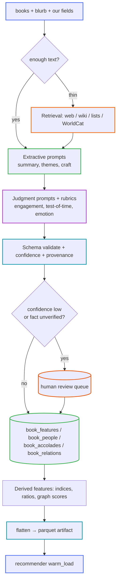
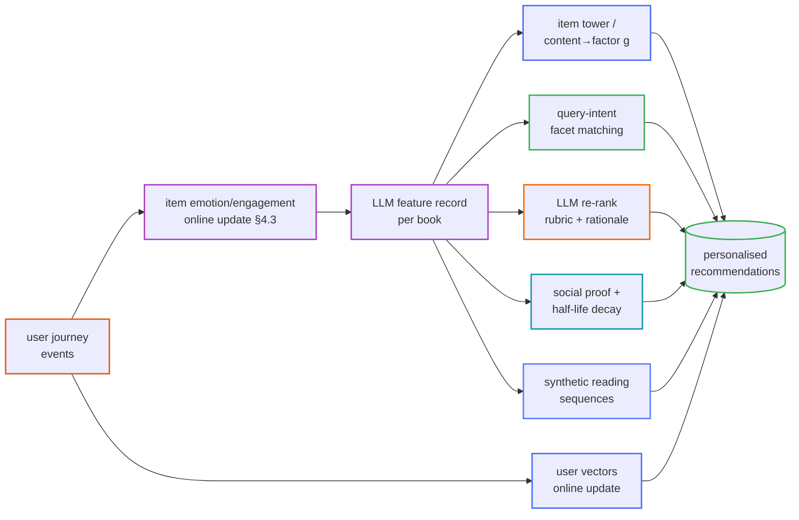

# LLM-Derived Book Features

A catalogue of features an LLM can **extract, retrieve-and-verify, judge, or compute** for each
book, the schema to store them, an emotion-modelling engine that self-corrects from reader
behaviour, and how every one of these feeds the
[intelligent recommendations plan](index.md#not-yet-built--collaborative--neural).

Today the recommender sees only what the merge pipeline produced: title, description, genres,
authors, rating, counts. That is a thin, mostly *lexical* view of a book. This document is the
plan to give every book a **rich, structured, provenanced feature record** so that queries like
"a hopeful book praised by a founder, nothing too violent, that has aged well" become
answerable.

---

## 1. Principles

<details open>
<summary><strong>The four feature types</strong> — how a value is produced decides how far to trust it</summary>

| Type | Definition | Example | Trust model |
|---|---|---|---|
| **Extractive** | pulled from text we already hold (blurb, front-matter, our own fields) | `five_sentence_summary`, `themes`, `storytelling_type` | high if source text is real; still record the source span |
| **Retrieval-augmented (RAG)** | LLM + an external source (web, Wikipedia, NYT list, WorldCat, publisher page) | `is_nyt_bestseller`, `copies_sold_estimate`, `foreword_by` | **must cite a source URL/snippet**; unverifiable → `confidence` capped low, flagged `needs_review` |
| **Judgment** | LLM applies a rubric and scores | `engagement_score`, `test_of_time`, `emotion_profile` | calibrate against a human golden set; store rubric + model version |
| **Derived** | a formula over other features | `social_proof_index`, `difficulty_ramp`, `evidence_basis_ratio` | deterministic; re-computed whenever inputs change |

</details>

<details>
<summary><strong>Non-negotiables</strong></summary>

- **The LLM proposes, a check confirms.** Any *fact* about the world (bestseller status, sales,
  who wrote the foreword, awards) is RAG with a citation or it does not get a high confidence.
  Never let the model assert `nyt_bestseller_no_1` from vibes.
- **Provenance on every row**: `source`, `evidence` (span or URL+snippet), `model`,
  `prompt_version`, `extracted_at`, `confidence` ∈ [0,1], `status` ∈
  `{auto, needs_review, verified, rejected}`.
- **Blurb bias is real.** Publishers cherry-pick praise and print only flattering quotes. A
  feature derived from the jacket copy is a feature about *the marketing*, not always the book —
  label it.
- **Cost control**: 2.5M books × many prompts is prohibitive. Enrich in **ratings_count
  order** (same top-N logic as [`build_artifacts.py`](../../src/recommend/build_artifacts.py)),
  cheap models for extraction, expensive models only for judgment on the top slice, cache every
  raw response, backfill lazily.
- **Everything is re-runnable and versioned** by `prompt_version` so a better prompt triggers a
  targeted re-extraction, not a full rebuild.

</details>

---

## 2. Feature catalogue

Nine families. Each feature lists: **T**ype (E/RAG/J/D), inputs, output shape, refresh cadence.

### A — Endorsement & social proof

<details open>
<summary><strong>Who vouches for this book, and how big is the crowd</strong></summary>

| Feature | T | Output | Notes |
|---|---|---|---|
| `foreword_by` / `introduction_by` / `afterword_by` | RAG | `[{name, person_id, relationship}]` | "books with a foreword by James Clear" |
| `blurbs` | E+RAG | `[{quote, endorser, endorser_id, source}]` | from jacket copy + book pages |
| `endorser_profile` | J | per endorser: `{domain, role, fame_tier, credibility_for_topic}` | domain ∈ `{founder/CEO, scientist, author, politician, athlete, celebrity, journalist, academic}`; powers "praised by CEOs", "praised by Nobel laureates" |
| `endorsement_strength` | J | 0–1 | "changed my life" ≫ "a solid read"; discount generic puffery |
| `is_nyt_bestseller` | RAG | bool + `{lists:[...], peak_rank, weeks_on_list, year}` | also Sunday Times, WSJ, USA Today, Amazon Charts, Indie, Spiegel |
| `nyt_bestseller_no_1` | RAG | bool + date | derived from `peak_rank == 1` |
| `copies_sold_estimate` | RAG | `{value, unit, as_of, source, is_estimate}` | "millions of copies", "1M+" — bucketed, never precise-fake |
| `review_volume` | D | from `ratings_count` + retrieved Goodreads/Amazon counts | `100k_reviewers` flag |
| `awards` | RAG | `[{name, category, year, result: won/shortlist/longlist}]` | Pulitzer, Booker, Hugo, Nebula, National Book, etc. |
| `printings` | RAG | `{edition_count, latest_printing, anniversary_editions}` | "14th printing" ≈ longevity |
| `translations` | RAG | `{language_count, languages[]}` | reach proxy |
| `adaptations` | RAG | `[{medium: film/tv/stage/game, year, title, notability}]` | |
| `curated_list_membership` | RAG | `[{list, curator}]` | "Bill Gates summer list", "Obama's books of 2023", school syllabi, "1001 Books..." |
| `social_proof_index` | D | 0–100 | weighted blend of the above; a single ranked "how validated" scalar |

</details>

### B — Content distillation

<details>
<summary><strong>What the book says, compressed at several resolutions</strong></summary>

| Feature | T | Output |
|---|---|---|
| `one_line` | J | ≤ 20-word "big idea" / logline |
| `five_sentence_summary` | E | exactly 5 sentences, spoiler-free |
| `extended_summary` | E | ~250 words |
| `premise` / `controlling_idea` | J | the single argument or dramatic question the book turns on |
| `themes` | E | `[{theme, salience}]` (love, power, mortality, ambition, exile…) |
| `motifs` | E | recurring images/symbols |
| `lessons` | E | `[{lesson, chapter_hint, actionable: bool}]` — "number of lessons" = `len()` |
| `frameworks` | E | named models the book introduces (`OKRs`, `Ikigai`, `Hedgehog Concept`, `2-minute rule`) |
| `claims` | J | `[{claim, falsifiable: bool, evidence_type}]` — the checkable assertions |
| `quotable_lines` | E | `[{quote, location}]`; `aphorism_density` = per-page rate |
| `glossary` | E | domain terms a newcomer needs |
| `prerequisites` | J | what you should already know/read first |
| `who_its_for` / `who_should_skip` | J | reader personas |

</details>

### C — Narrative craft (fiction)

<details>
<summary><strong>How the story is built</strong></summary>

| Feature | T | Output |
|---|---|---|
| `storytelling_type` | J | `linear`, `nonlinear`, `frame_story`, `epistolary`, `multi_POV`, `braided_timelines`, `in_media_res`, `unreliable_narrator`, `vignette` (multi-label) |
| `structure` | J | act model, "hero's journey" beats hit, chapter count, avg chapter length |
| `pov` / `tense` | E | 1st/2nd/3rd-limited/omniscient; past/present |
| `twist_count` | J | number of major reversals; `twist_positions` (normalised 0–1) — "thrillers with 3+ twists" |
| `pacing_curve` | J | 10-point tension series → shapes: `slow_burn`, `rollercoaster`, `front_loaded`, `late_bloomer` |
| `ending_type` | J | `resolved`, `open`, `twist`, `bittersweet`, `cliffhanger`, `downer` |
| `character_archetypes` | E | protagonist + key cast archetypes |
| `protagonist_agency` | J | 0–1: does the lead drive events or get driven |
| `ensemble_vs_lead` | J | scalar |
| `setting` | E | `{era, span_years, geography, real_or_secondary_world}` |
| `content_warnings` | J | `[{kind, intensity 0–1}]` — violence, sexual assault, grief, self-harm, abuse, gore, animal harm |
| `heat_level` | J | romance/sexual-content scale 0–5 |
| `voice` | J | descriptors: wry, lyrical, spare, maximalist, clinical, earnest |
| `humor_type` | J | none/dry/absurdist/satirical/slapstick |

</details>

### D — Nonfiction analysis

<details>
<summary><strong>How an argument book is made, and the patterns it contains</strong></summary>

| Feature | T | Output |
|---|---|---|
| `discipline` | E | economics, psychology, history, management, memoir-adjacent… |
| `evidence_basis` | J | mix over `{anecdote, journalism, original_research, meta_analysis, personal_experience, theory}` → `evidence_basis_ratio` (rigour proxy) |
| `citation_density` | E | references per chapter |
| `actionability` | J | `{exercises, checklists, worked_examples}` counts + 0–1 "can I apply this Monday" |
| `case_studies` | E | `[{entity, domain, years, outcome, what_it_illustrates}]` |
| `cross_entity_patterns` | J | **the "Measuring What Matters" ask**: given the book's case set (Intel, Google, YouTube…), extract the recurring success/failure patterns — `[{pattern, supporting_entities[], mechanism, counter_examples[], confidence}]` |
| `causal_claims` | J | `[{cause → effect, strength, contested: bool}]` |
| `originality` | J | 0–1: net-new ideas vs synthesis/popularisation |
| `rebuttals` | RAG | known critiques / rebuttal books |
| `updates_needed` | J | which claims are stale (see family E) |

</details>

### E — Temporal judgment ("test of time")

<details>
<summary><strong>Has the thinking aged well</strong></summary>

| Feature | T | Output |
|---|---|---|
| `test_of_time` | J | label ∈ `{ahead_of_its_time, timeless, of_its_moment, behind_its_time, dated}` + rationale |
| `prediction_scorecard` | RAG+J | `[{prediction, made_year, verdict: correct/partial/wrong/unresolved, checked_against}]` |
| `datedness` | J | 0–1: how much rests on tech/events/mores that moved on |
| `half_life` | D | estimated years until the core value decays 50% (∞ for literary classics) |
| `event_dependency` | J | does understanding require current-events context that fades |
| `revival_signal` | RAG | rediscovered/re-popular (TikTok, a new edition, a citing bestseller) |
| `canonical_status` | RAG | on syllabi / "great books" lists / cited as foundational |

</details>

### F — Engagement & difficulty

<details>
<summary><strong>Will a reader keep going, and how hard is it</strong></summary>

| Feature | T | Output |
|---|---|---|
| `engagement_score` | J | 0–1 "unputdownable"; rubric: hook speed, chapter-end pull, curiosity gaps, momentum |
| `hook_strength` | J | 0–1 for the first ~5 pages |
| `dropoff_risk` | J | 0–1 chance of abandonment + `dropoff_zone` (e.g. "act 2 sag 40–55%") |
| `readability` | D | Flesch–Kincaid / Dale–Chall over available text |
| `conceptual_density` | J | 0–1 ideas-per-page load (independent of prose difficulty) |
| `reading_time_minutes` | D | `num_pages` × words/page ÷ WPM, by reader speed band |
| `audiobook_suitability` | J | penalise footnote/diagram/table heavy; reward voice-driven |
| `snackability` | J | can be read in fragments vs demands long sessions |
| `re_read_value` | J | 0–1 |

</details>

### G — Emotional profile

<details>
<summary><strong>The felt experience of reading it</strong> — full engine in §4</summary>

| Feature | T | Output |
|---|---|---|
| `emotion_profile` | J+D | vector over a defined emotion ontology, each `{intensity 0–1, confidence}` |
| `valence` / `arousal` | J | dimensional affect, −1..1 and 0..1, plus a per-chapter series |
| `dominant_emotions` | D | top-k from the profile |
| `emotional_arc` | J | Reagan-et-al shape: `rags_to_riches`, `tragedy`, `man_in_hole`, `icarus`, `cinderella`, `oedipus` |
| `catharsis` | J | 0–1 emotional payoff at the end |
| `comfort_read` | J | 0–1 low-stakes/soothing |
| `intensity_ceiling` | J | peak emotional load — pairs with `content_warnings` for "nothing too intense" |
| `mood_tags` | D | human labels: cosy, bleak, hopeful, melancholic, propulsive, tender, unsettling |

</details>

### H — Relational / graph

<details>
<summary><strong>Where the book sits among other books</strong></summary>

| Feature | T | Output |
|---|---|---|
| `comparable_titles` | J+RAG | `[{book, book_id, why, axis: theme/tone/structure/idea}]` — grounded "if you liked…" |
| `intellectual_lineage` | RAG | books/thinkers it builds on |
| `cites_books` / `cited_by_books` | RAG | citation edges (esp. nonfiction) |
| `influence_score` | D | PageRank over `cited_by` |
| `read_order` | J | for a topic/series: a suggested sequence + rationale (feeds the **synthetic-sequence** idea in the recs plan) |
| `pairs_well_with` | J | complementary/contrasting reads |
| `supersedes` / `superseded_by` | RAG+J | newer editions or better modern treatments |

</details>

### I — Reception synthesis

<details>
<summary><strong>What the crowd and the critics actually said</strong></summary>

| Feature | T | Output |
|---|---|---|
| `critic_consensus` | RAG | 2–3 sentences synthesised from reviews, with sources |
| `reader_consensus` | RAG | same from user reviews |
| `praise_points` / `complaint_points` | J | ranked lists ("brilliant premise", "sags in the middle", "ending rushed") |
| `polarization` | D | variance / bimodality of ratings → "love-it-or-hate-it" flag |
| `critic_reader_gap` | D | where reviewers and readers disagree |
| `expectation_setting` | J | is it marketed as what it is (thriller sold as literary, etc.) |

</details>

---

## 3. Data model

<details open>
<summary><strong>Schema additions</strong> (sketch — see the implementation prompt in §9)</summary>

Keep `books` lean. Add typed side tables so features are sparse, versioned, and provenanced.

```sql
-- Generic key/value feature store: one row per (book, feature, prompt_version).
CREATE TABLE book_features (
    book_id        INTEGER NOT NULL REFERENCES books(book_id),
    feature        TEXT    NOT NULL,          -- e.g. 'five_sentence_summary', 'engagement_score'
    value_json     TEXT    NOT NULL,          -- scalar, list, or object as JSON
    confidence     REAL,                      -- 0..1
    feature_type   TEXT    NOT NULL,          -- extractive | rag | judgment | derived
    source         TEXT,                      -- 'blurb' | 'wikipedia:<url>' | 'derived:<formula>' ...
    evidence       TEXT,                      -- span text or URL+snippet
    model          TEXT,                      -- model id
    prompt_version TEXT    NOT NULL,
    status         TEXT    NOT NULL DEFAULT 'auto',  -- auto | needs_review | verified | rejected
    extracted_at   TEXT    NOT NULL,
    PRIMARY KEY (book_id, feature, prompt_version)
);
CREATE INDEX idx_book_features_feature ON book_features(feature);

-- People who endorse / preface, normalised so "praised by <domain>" is a join.
CREATE TABLE people (
    person_id  INTEGER PRIMARY KEY,
    name       TEXT NOT NULL UNIQUE,
    domain     TEXT,        -- founder_ceo | scientist | author | politician | athlete | celebrity | academic | journalist
    fame_tier  INTEGER,     -- 1..5
    notes      TEXT
);
CREATE TABLE book_people (
    book_id      INTEGER NOT NULL REFERENCES books(book_id),
    person_id    INTEGER NOT NULL REFERENCES people(person_id),
    relationship TEXT NOT NULL,   -- foreword | introduction | afterword | blurb | dedication
    quote        TEXT,
    strength     REAL,            -- endorsement_strength 0..1
    source       TEXT,
    PRIMARY KEY (book_id, person_id, relationship)
);

-- Facts with a shape of their own.
CREATE TABLE book_accolades (
    book_id   INTEGER NOT NULL REFERENCES books(book_id),
    kind      TEXT NOT NULL,      -- nyt_bestseller | award | sales | printing | translation | list | adaptation
    detail_json TEXT NOT NULL,    -- {list, peak_rank, weeks} / {name, year, result} / {value, unit, as_of} ...
    source    TEXT NOT NULL,
    confidence REAL,
    verified_at TEXT,
    PRIMARY KEY (book_id, kind, detail_json)
);

-- Book-to-book edges.
CREATE TABLE book_relations (
    src_book_id INTEGER NOT NULL REFERENCES books(book_id),
    dst_book_id INTEGER REFERENCES books(book_id),   -- null if the target isn't in our catalogue
    dst_hint    TEXT,                                -- title/author string when dst_book_id is null
    relation    TEXT NOT NULL,   -- comparable | cites | cited_by | lineage | read_next | pairs_with | superseded_by
    axis        TEXT,            -- theme | tone | structure | idea
    why         TEXT,
    weight      REAL,
    PRIMARY KEY (src_book_id, relation, COALESCE(dst_book_id, 0), COALESCE(dst_hint, ''))
);
```

A **materialised view / parquet artifact** flattens the "current best" feature per book (max
`prompt_version`, `status != rejected`) into a wide table for the recommender to `mmap` —
loaded exactly like the tfidf/lsa/semantic artifacts via
[`src/recommend/artifacts.py`](../../src/recommend/artifacts.py).

</details>

---

## 4. The emotion engine

The ask: *concrete definitions of human emotions; heuristic formulae from words; an
"auto-correct" engine that assigns the book a value and keeps updating it from the user
journey.* Three layers.

### 4.1 An emotion ontology with operational definitions

<details open>
<summary><strong>Definition template + worked examples</strong></summary>

Every emotion in the ontology is specified as a struct, so both the lexical scorer and the LLM
rubric point at the *same* target:

```yaml
emotion: dread
definition: >
  Anticipatory fear directed at a specific, expected, hard-to-avert bad outcome;
  distinct from anxiety (diffuse, no object) and terror (present, acute).
textual_markers:
  lexical:   [looming, inevitable, too late, closing in, no way out, countdown, "something was wrong"]
  syntactic: [future-tense threat, foreshadowing clauses, shortening sentences, sensory narrowing]
narrative_triggers: [ticking clock, isolation, a known monster off-page, a promise of return]
distinguish_from:
  anxiety: object is unclear
  suspense: reader lacks info the character has (dread = both know, can't stop it)
measurement:                # rubric anchors for the 0..1 judgment score
  0.1: a passing unease, quickly resolved
  0.5: a sustained shadow over one act
  0.9: the organising mood of the whole book
```

Ontology to cover (≈ 20, literary-relevant, beyond the basic six): `awe, wonder, dread,
suspense, poignancy, nostalgia, melancholy, hope, catharsis, tenderness, righteous_anger,
indignation, disgust, contempt, schadenfreude, joy, exhilaration, grief, loneliness, yearning,
shame, guilt, relief, unease, comfort`.

</details>

### 4.2 Lexical heuristic scores (cheap, always-on)

<details>
<summary><strong>Formula shape</strong></summary>

For emotion `e` and book text `b` (blurb + any available excerpt, split into sections `s`):

```
raw(e, b) = Σ_s  position_weight(s) · Σ_w  tf(w, s) · lex_e(w) · negation(w, s) · intensifier(w, s)

lex_e(w)          ∈ [0,1]   weight of word w in emotion e's lexicon (NRC/VAD seed, LLM-expanded)
negation(w,s)     = -0.8 if within a negation scope, else 1
intensifier(w,s)  = 1 + 0.5·[very/utterly/…] - 0.3·[somewhat/slightly/…]
position_weight   = 1.0 body, 1.6 final section, 1.3 opening   (endings colour memory)

score_lex(e, b) = squash( raw(e,b) / length_norm(b) )          # squash = logistic → [0,1]
```

Also compute dimensional affect directly: `valence_lex`, `arousal_lex` as tf-weighted means of
per-word VAD norms. These are the **prior mean**; their **variance** is high when `b` is short
(a 40-word blurb → wide prior) and lower with real excerpt text.

</details>

### 4.3 LLM-calibrated profile + the self-correcting updater

<details open>
<summary><strong>Prior → posterior from the user journey</strong></summary>

Maintain, per `(book, emotion)`, a Beta-style belief `Beta(α_e, β_e)` (or a Gaussian
`N(μ_e, σ_e²)` for valence/arousal). Point estimate `θ_e = α_e / (α_e + β_e)`; confidence grows
with `α_e + β_e`.

**Initialise** (the "assigns a value to the book" step):

```
α_e ⁰ = κ · [ w_lex · score_lex(e,b) + w_llm · score_llm(e,b) ]
β_e ⁰ = κ · [ 1 - ( w_lex · score_lex(e,b) + w_llm · score_llm(e,b) ) ]
κ  = base_evidence · text_completeness(b)      # low κ ⇒ weak prior ⇒ moves fast
```

**Update** (the "keeps updating as more info is available based on user journey" step) — each
reader signal `y` is mapped to evidence for/against specific emotions and folded in online:

| Journey signal | Interpreted as |
|---|---|
| abandons at 45%, right after a dark chapter | +dread / +bleak, −comfort |
| tagged "made me cry" / long dwell on ending | +grief, +poignancy, +catharsis |
| re-reads; adds to "comfort" shelf | +comfort, +tenderness, −intensity |
| review sentiment + emotion classification | soft evidence on named emotions |
| "too intense, DNF" button | +intensity_ceiling, raise `content_warnings` prior |
| skips ahead / skims | −engagement (family F), not emotion |

```
for each new signal y about emotion e (with reliability r_y ∈ (0,1]):
    α_e ← α_e + r_y · 1[y supports e]
    β_e ← β_e + r_y · 1[y contradicts e]
θ_e  ← α_e / (α_e + β_e)
σ_e  ← sqrt( θ_e(1-θ_e) / (α_e+β_e+1) )        # shrinks as readers accrue
```

This is an **auto-correcting predictor**: a wrong prior (say the LLM over-rated "hope" from a
misleadingly upbeat blurb) is dragged toward reality as thousands of real reactions arrive, and
the model's stated **confidence** rises only when evidence agrees. Equivalent Kalman form:
`θ ← θ + K·(y − θ)`, `K = σ²_prior / (σ²_prior + σ²_obs)`.

**Note the symmetry with the recs plan:** this is the *item-side* twin of the *user-side*
online loop in [§Part 1 of the recs discussion](index.md) — `u_content`/`u_factors` update per
user interaction; `θ_e` updates per interaction *aggregated over users*. Same machinery, other
axis of the matrix.

</details>

---

## 5. Extraction architecture

<details>
<summary><strong>Pipeline</strong></summary>



- **Prompt families**, one per row-group above; each returns strict JSON validated against a
  Pydantic schema (reuse the `src/api/schemas.py` style). A parse/scheme failure retries once,
  then routes to review.
- **Batching**: group books, one feature-family per call, cheap model for E, mid model for
  J on the top slice. Cache the *raw* response keyed by `(book_id, family, prompt_version,
  model)` so re-runs are free.
- **Incremental**: a nightly job enriches newly-ingested books and any book whose
  `prompt_version` is behind the current one, in `ratings_count` order, under a daily cost cap.
- **Provider-agnostic client** with a `--dry-run` that prints the prompt + a token/cost
  estimate and writes nothing.

</details>

---

## 6. Connection to the intelligent recommendations plan

These features are the missing **item-side substance** the [recs improvement
plan](index.md#not-yet-built--collaborative--neural) assumes exists.

<details open>
<summary><strong>Where each family plugs in</strong></summary>

| Recs-plan component | What these features give it |
|---|---|
| **Item tower** (two-tower neural retrieval) | the structured feature record *is* the item-tower input — endorsement, craft, emotion, difficulty, temporal, graph — so an item embeds well before it has a single rating |
| **Content → factor bridge `g`** (cold-start) | regress `emb(features) → ALS item factors`; a brand-new book gets latent factors from its feature record, killing item cold-start |
| **Query-intent facet matching** | structured facets make hard queries literal joins: "praised by CEOs" → `book_people ⋈ people.domain='founder_ceo'`; "nothing too violent" → `content_warnings.violence < τ`; "aged well" → `test_of_time ∈ {timeless, ahead_of_its_time}`; "a book that answers <question>" → semantic match over `lessons`/`frameworks`/`claims` |
| **Hybrid fusion (`hybrid` method)** | add feature-filtered and facet-scored rankers as extra RRF inputs alongside `lexical` / vector |
| **LLM re-rank stage** | the rubric it scores against = these features; and it can *explain* using `why` fields from `book_relations`, `praise_points`, `emotional_arc` |
| **Popularity / time-decay** | `social_proof_index` replaces raw `ratings_count`; `half_life` + `event_dependency` drive the decay so "loved in 2009" fades correctly |
| **Item–item CF / ALS priors** | `comparable_titles` and `cites/cited_by` edges seed the item-similarity graph *before* co-rating data exists, and regularise it after |
| **Sequential models (BERT4Rec) pretraining** | `read_order`, `intellectual_lineage`, series/`pairs_well_with` edges generate the **synthetic sequences** the plan calls for, with richer transitions than "same author, by year" |
| **Item-side online learning** | the §4.3 emotion/engagement updater is the item analogue of the user-vector online update — the whole system learns on both axes of `R` from the same interaction stream |
| **Evaluation** | `polarization`, `critic_reader_gap`, `expectation_setting` are features *and* guardrails — flag books likely to disappoint a given intent |

</details>



---

## 7. Evaluation & QA

<details>
<summary><strong>Trust, calibrated</strong></summary>

- **Golden set**: 300–500 books hand-annotated for the judgment features; measure LLM vs human
  agreement (Krippendorff's α, MAE for scalars). Ship a feature only above an agreement bar.
- **Calibration**: bucket `confidence`; check that stated 0.8 confidence is right ~80% of the
  time; recalibrate.
- **Fact audit**: sample RAG features (`nyt_bestseller`, `foreword_by`, `copies_sold`) and
  verify the cited source actually supports the value; track hallucination rate per prompt
  version.
- **Drift**: re-score a fixed sample each model/prompt bump; alert on large distribution shifts.
- **Downstream**: A/B the recommender with vs without a feature family; keep only families that
  move offline ranking metrics or reduce "disappointed" feedback.

</details>

---

## 8. Risks & mitigations

<details>
<summary><strong>Known failure modes</strong></summary>

| Risk | Mitigation |
|---|---|
| Hallucinated facts (fake bestseller, invented blurb) | RAG-only for facts; citation required; fact audit; low-confidence → `needs_review` |
| Jacket-copy bias (only flattering praise printed) | label blurb-sourced features; weight `endorsement_strength` down for generic praise; cross-check with critic/reader consensus |
| Spoilers leaking into summaries | explicit "spoiler-free" constraint + a spoiler-detector pass on `five_sentence_summary` |
| Cultural / language bias in emotion + "test of time" | multilingual lexicons; diverse golden-set annotators; per-language calibration |
| Cost blowout at catalogue scale | ratings_count-ordered backfill, cheap models for extraction, daily cap, aggressive caching |
| Staleness (`is_nyt_bestseller` true forever) | facts carry `as_of` / `verified_at`; scheduled re-verification for volatile fields |
| Feedback loop (recommending only what we enriched) | enrich a random exploration slice, not just head titles |
| Privacy (journey-derived item updates aggregate user behaviour) | item features store only aggregates, never per-user rows; same retention policy as the user-profile store |

</details>

---

## 9. Rollout stages

1. **Framework + schema** — the four tables, the artifact flattener, `src/enrich/` package
   (registry + provider-agnostic client + validation + provenance + dry-run), no features yet.
2. **6 high-value features** over the top ~50k books: `five_sentence_summary`, `one_line`,
   `storytelling_type`, `lessons`, `test_of_time`, `emotion_profile` (LLM prior only).
3. **Endorsement & social proof** (RAG) + `social_proof_index`; wire the "praised by / foreword
   by" facet into `/recommend`.
4. **Emotion online updater** (§4.3) fed by the query-log/journey stream from the recs plan.
5. **Graph features** (`comparable_titles`, `cites/cited_by`) → seed item–item CF and synthetic
   sequences.
6. **Scale-out** to the top ~300k (match the artifact build), add nightly incremental backfill,
   plug the feature record into the item tower / bridge `g`.

---

## 10. Implementation prompt (paste into a new session)

<details open>
<summary><strong>Prompt</strong></summary>

```text
You are working in the-bookfather repo. First read, in full:
  CLAUDE.md
  docs/recommendation/index.md
  docs/recommendation/llm-derived-features.md   ← the plan you are implementing
  src/config.py
  src/db/schema.sql, src/db/build_db.py
  src/cleaning/pipeline.py, src/cleaning/readers.py
  src/recommend/registry.py, src/recommend/artifacts.py, src/recommend/build_artifacts.py
  src/api/main.py, src/api/schemas.py, src/api/repository.py
Also invoke the `claude-api` skill before writing any LLM-calling code, and follow CLAUDE.md
(SOLID, exception handling, info logs for major events, debug logs for minor calls, stdout +
rotating file via src/config.get_logger).

GOAL — implement Stage 1 + Stage 2 of docs/recommendation/llm-derived-features.md:
the enrichment framework, the schema, and the first 6 features, over a bounded slice of books.

DELIVERABLES

1. Schema (src/db/schema.sql + a migration path in build_db.py):
   add tables book_features, people, book_people, book_accolades, book_relations exactly as
   sketched in §3 of the plan (JSON value columns, confidence, full provenance:
   source/evidence/model/prompt_version/status/extracted_at). Add indexes shown. Do NOT widen
   the `books` table.

2. src/enrich/ package, mirroring the structure of src/recommend/:
   - base.py       Feature ABC: name, family, feature_type (extractive|rag|judgment|derived),
                   prompt_version, output Pydantic schema, and extract(book_ctx) -> FeatureRow.
   - client.py     provider-agnostic LLM client per the claude-api skill; batching; raw-response
                   cache keyed by (book_id, family, prompt_version, model); --dry-run that prints
                   the rendered prompt + token/cost estimate and writes nothing; retry-once then
                   route-to-review on invalid JSON.
   - schemas.py    Pydantic models for each feature's output + FeatureRow (the row written to
                   book_features).
   - registry.py   FEATURES dict + get()/list(); Stage-2 set registered:
                   five_sentence_summary, one_line, storytelling_type, lessons, test_of_time,
                   emotion_profile.
   - features/     one module per feature; strict JSON, spoiler-free constraint on summaries,
                   rubric text embedded for judgment features, confidence + evidence span
                   populated. emotion_profile: LLM prior only for now (lexical scorer +
                   online updater are a later stage) but emit the per-emotion
                   {intensity, confidence} vector over the ontology in §4.1.
   - persist.py    upsert FeatureRows into the new tables; status='needs_review' when
                   confidence < threshold or (feature_type=='rag' and no citation).
   - build_features.py   offline CLI, same ergonomics as build_artifacts.py:
                   python -m src.enrich.build_features --features <csv|all> --max-books N
                   [--model ...] [--dry-run] [--db PATH]
                   selects top-N books by COALESCE(ratings_count,0) DESC that have a
                   description; logs per-stage INFO, per-book DEBUG, cost + counts summary;
                   re-runnable; idempotent via the (book_id,feature,prompt_version) PK.
   - flatten.py    build data/artifacts/features/ : a parquet of the current best feature per
                   book (max prompt_version, status != rejected) + book_ids.npy + meta.json,
                   loadable by src/recommend/artifacts.py the same way tfidf/lsa/semantic are.

3. Wire-in (thin, non-breaking):
   - src/recommend/artifacts.py: add get_features() + warm_load of data/artifacts/features/.
   - src/api/main.py: extend GET /books/{book_id} response with an optional `features` block
     when present. Do NOT change existing response shapes for search/recommend.
   - src/config.py: no new dirs needed beyond ARTIFACTS_DIR (features live under it).

4. Tests (pytest, no network / no paid API — mock the LLM client):
   - schema creates cleanly; PK/idempotency on re-run.
   - each feature module: given a canned book context + a stubbed LLM JSON response, produces a
     valid FeatureRow with provenance populated; invalid JSON → review path.
   - flatten.py produces a parquet whose row count == distinct enriched book_ids.
   - --dry-run writes nothing and returns a cost estimate.

5. Docs:
   - new docs/enrichment/index.md (hierarchical, details/summary, one mermaid, dark/light
     friendly, <=10 stroke-only colours, A4) covering: the tables, the CLI, prompt-version
     policy, review queue, cost controls, and a status table of which features are live.
   - link it from docs/index.md and from docs/recommendation/llm-derived-features.md.
   - update README.md "Current state" with an "LLM feature enrichment (Stage 1-2)" row.

CONSTRAINTS
   - Enrich only the slice passed via --max-books; default 5000 for a cheap first run.
   - Every written row MUST have model, prompt_version, extracted_at, and either evidence span
     (extractive) or citation (rag) or formula (derived).
   - Keep base requirements.txt changes minimal; if an LLM SDK is needed, add it and note it.
   - No feature is trusted as fact without a citation — enforce in persist.py.

VERIFY at the end:
   python -m src.enrich.build_features --features all --max-books 50 --dry-run   # prints cost, writes nothing
   python -m src.enrich.build_features --features five_sentence_summary,emotion_profile --max-books 50
   python -m src.enrich.flatten
   pytest -q
   python -m uvicorn src.api.main:app --port 8080 &   then   curl localhost:8080/books/<an_enriched_id>
   # show that /books/search and /recommend responses are unchanged.

Produce a short plan first (EnterPlanMode), then implement.
```

</details>
